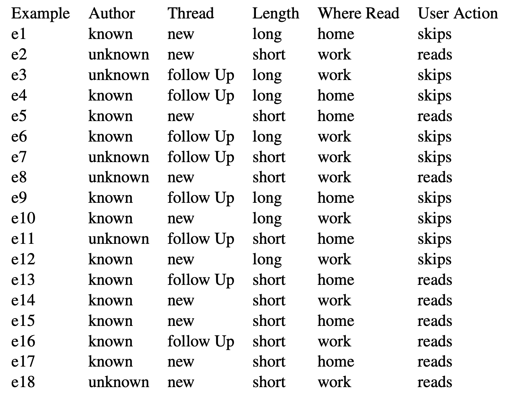
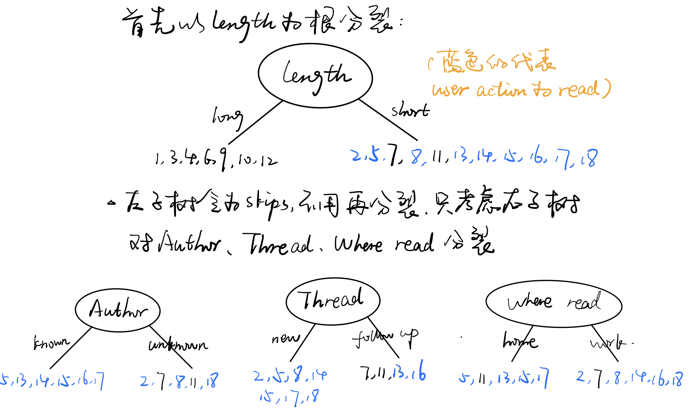
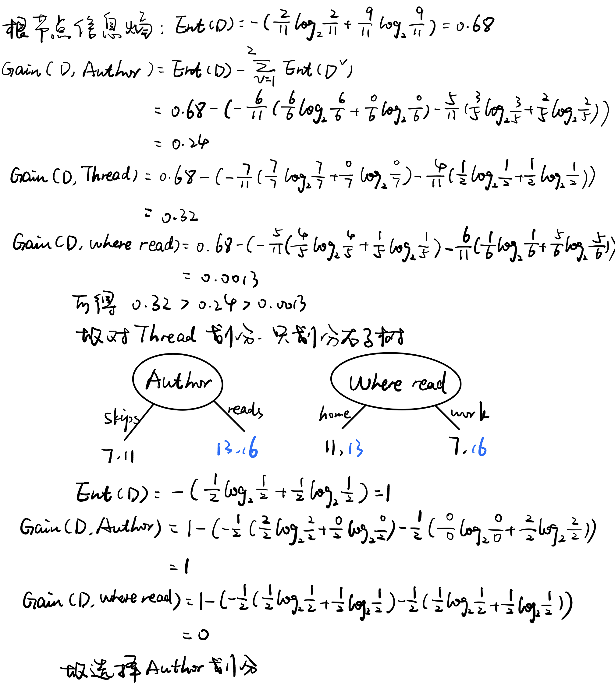
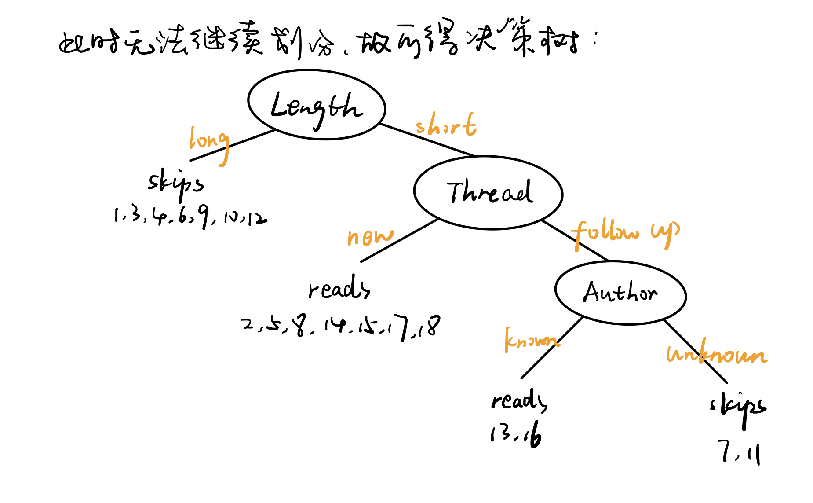
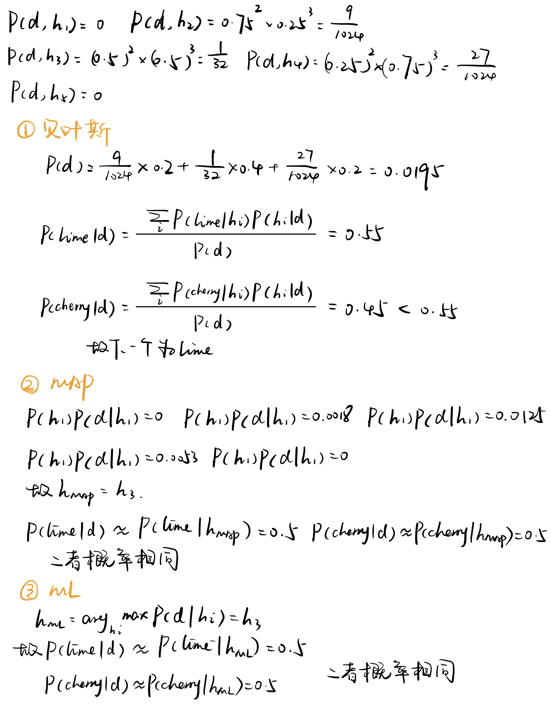
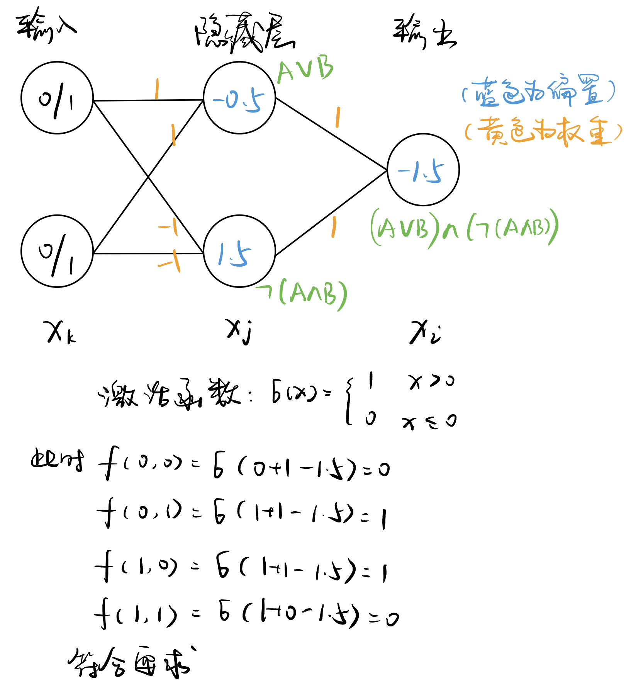

<h1 align=center>AI (Fall 2020) – Assignment 4</h1>

<h1 align=center>Machine Learning</h1>

<h1 align=center>何泽  18340052</h1>

## Ⅰ

> Consider the following data. The DECISION-TREE-LEARNING algorithm will first select the at- tribute Length to split on. Finish building the decision tree, and show the computations.
>
> 

## Ⅱ

> Consider the candy example from the lecture. Assume that the prior distribution over $h1, \ldots, h5$ is given by $\{0.1, 0.2, 0.4, 0.2, 0.1\}$. Suppose that the first 5 candies taste lime, cherry, cherry, lime, and lime. Make predictions for the 6th candy using Bayesian, MAP and ML learning, respectively. Showth e computations done to make the predictions.

## Ⅲ

> Consider the Boolean function $E = (A\;\mathrm{XOR}\;B) \;\mathrm{AND}\; (C\;\mathrm{XOR}\;D)$. Construct its truth table, and then remove the line for the input $A = 1, B = 1, C = 1, D = 1$. Use Naive Bayes classification to make prediction for this input. Show the computations.

真值表：

|  A   |  B   |  C   |  D   |  E   |
| :--: | :--: | :--: | :--: | :--: |
|  0   |  0   |  0   |  0   |  0   |
|  0   |  0   |  0   |  1   |  0   |
|  0   |  0   |  1   |  0   |  0   |
|  0   |  0   |  1   |  1   |  0   |
|  0   |  1   |  0   |  0   |  0   |
|  0   |  1   |  0   |  1   |  1   |
|  0   |  1   |  1   |  0   |  1   |
|  0   |  1   |  1   |  1   |  0   |
|  1   |  0   |  0   |  0   |  0   |
|  1   |  0   |  0   |  1   |  1   |
|  1   |  0   |  1   |  0   |  1   |
|  1   |  0   |  1   |  1   |  0   |
|  1   |  1   |  0   |  0   |  0   |
|  1   |  1   |  0   |  1   |  0   |
|  1   |  1   |  1   |  0   |  0   |

$$
\begin{aligned}
P(E\mid A,B,C,D)
&=\frac{P(A,B,C,D\mid E)P(E)}{P(A,B,C,D)}\\
&=\frac{P(A\mid E) P(B\mid E) P(C\mid E) P(D\mid E) P(E)}{P(A,B,C,D)}\\
&=\frac{\frac12 \times\frac12 \times\frac12 \times\frac12 \times\frac4{15}}{\frac1{15}}\\
&=\frac{1}{4}\\ \\
P(\lnot E\mid A,B,C,D)
&=\frac{P(A,B,C,D\mid \lnot E)P(\lnot E)}{P(A,B,C,D)}\\
&=\frac{P(A\mid \lnot E) P(B\mid \lnot E) P(C\mid \lnot E) P(D\mid \lnot E) P(\lnot E)}{P(A,B,C,D)}\\
&=\frac{\frac5{11} \times\frac5{11} \times\frac5{11} \times\frac5{11} \times\frac{11}{15}}{\frac5{11}}\\
&=\frac{625}{1331}
\end{aligned}
$$

$\frac{625}{1331}>\frac14$ 故E=0 。

## Ⅳ

> Construct a neural network that computes the $XOR$ function of two inputs.

因为$A \oplus B= (A \lor B) \land (\lnot (A \land B))$

故可以如下构造神经网络：

## Ⅴ

> Consider the neural net on Page 32 of the course slides for neural nets.
>
> - Suppose we use the sigmoid function as the activate function. Compute $\partial {Loss_{o1}}/\partial{w_1}$
>
> - Suppose we use the $\tanh$ function as the activate function. Compute $\partial{Loss_{o2}}/\partial{w_4}$.
>
>      Note that  $tanh(x) = (e^x - e^{-x})/(e^x + e^{-x}) = 2g(2x) - 1,\ 
>         \tanh'(x) = 1 - \tanh^2(x)$

1. 

$$
\begin{array}{llll}
in_{h1} &= w_1 i_1 + w_2 i_2 + b_1 &= 0.05\times  0.15 + 0.10 \times  0.20 + 0.35 &= 0.3775\\
in_{h2} &= w_3 i_1 + w_4 i_2 + b_1 &= 0.05\times  0.25 + 0.10 \times  0.30 + 0.35 &= 0.3925\\
out_{h1} &= g(in_{h1}) &= \frac{1}{1+e^{-0.3775}} &=0.5933\\
out_{h2} &= g(in_{h2}) &= \frac{1}{1+e^{-0.3875}} &=0.5969\\
in_{o1} &= w_5 out_{h1} + w_6 out_{h2} +b_2 &= 0.4\times  0.5933 + 0.45\times  0.5969 + 0.60 &= 1.1059\\
in_{o2} &= w_7 out_{h1} + w_8 out_{h2} +b_2 &= 0.5\times  0.5937 + 0.55\times  0.5969 + 0.60 &= 0.9099\\
out_{o1} &= g(in_{o1}) &=\frac{1}{1+e^{-1.1059}} &= 0.7514\\
out_{o2} &= g(in_{o2}) &=\frac{1}{1+e^{-0.9099}} &= 0.7729\\
Loss_{o1} &= (target_{o1}-out_{o1})^2 &= (0.01-0.7514)^2 &=0.5496\\
Loss_{o2} &= (target_{o2}-out_{o2})^2 &= (0.99-0.7729)^2 &=0.0471
\end{array}
$$

$$
\\ \frac{\partial{Loss_{o1}}}{\partial{w_1}}=\frac{\partial{Loss_{o1}}}{\partial{out_{o1}}}\times\frac{\partial{out_{o1}}}{\partial in_{o1}}\times\frac{\partial{in_{o1}}}{\partial out_{h1}}\times\frac{\partial{out_{h1}}}{\partial in_{h1}}\times\frac{\partial{in_{h1}}}{\partial w_1}
$$

$$
\begin{array}{lll}
        \frac{\partial{Loss_{o1}}}{\partial out_{o1}}&=-2(target_{o1}-out_{o1})&=-1.4827\\
        \frac{\partial{out_{o1}}}{\partial in_{o1}}&=out_{o1}(1-out_{o1})&=0.1868\\
        \frac{\partial{in_{o1}}}{\partial out_{h1}}&=w_5&=0.40\\
        \frac{\partial{out_{h1}}}{\partial in_{h1}}&=out_{h1}(1-out_{h1})&=0.2413\\
        \frac{\partial{in_{h1}}}{\partial w_1}&=i1&=0.05
    \end{array}\
$$

故$\frac{\partial{Loss_{o1}}}{w_1}=-0.0013$

2. 

$$
\begin{array}{lll}
        in_{h1} &= w_1 i_1 + w_2 i_2 + b_1 &= 0.3775\\
        in_{h2} &= w_3 i_1 + w_4 i_2 + b_1 &= 0.3925\\
        out_{h1} &= \tanh(in_{h1}) &=0.3605\\
        out_{h2} &= \tanh(in_{h2}) &=0.3735\\
        in_{o1} &= w_5 out_{h1} + w_6 out_{h2} +b_2 &= 0.9123\\
        in_{o2} &= w_7 out_{h1} + w_8 out_{h2} +b_2 &= 0.9857\\
        out_{o1} &= \tanh(in_{o1}) &= 0.7222\\
        out_{o2} &= \tanh(in_{o2}) &= 0.7555\\
        Loss_{o1} &= (target_{o1}-out_{o1})^2 &=0.5073\\
        Loss_{o2} &= (target_{o1}-out_{o2})^2 &=0.0550
\end{array}
$$

$$
\frac{\partial{Loss_{o2}}}{\partial w_4}=\frac{\partial{Loss_{o2}}}{\partial out_{o2}}\times\frac{\partial{out_{o2}}}{\partial in_{o2}}\times\frac{\partial{in_{o2}}}{\partial out_{h2}}\times\frac{\partial{out_{h2}}}{\partial in_{h2}}\times\frac{\partial{in_{h2}}}{\partial w_4}
$$

$$
\begin{array}{llll}
        \frac{\partial{Loss_{o2}}}{\partial out_{o2}}&=2(target_{o2}-out_{o2})&=0.4689\\
        \frac{\partial{out_{o2}}}{\partial in_{o2}}&=1-out_{o2}^2&=0.4292\\
        \frac{\partial{in_{o2}}}{\partial out_{h2}}&=w_8&=0.55\\
        \frac{\partial{out_{h2}}}{\partial in_{h2}}&=1-out_{h2}^2&=0.8605\\
        \frac{\partial{in_{h2}}}{\partial w_4}&=i2&=0.10
    \end{array}
$$

故$\frac{\partial{Loss_{o2}}}{\partial w_4}=0.0095$